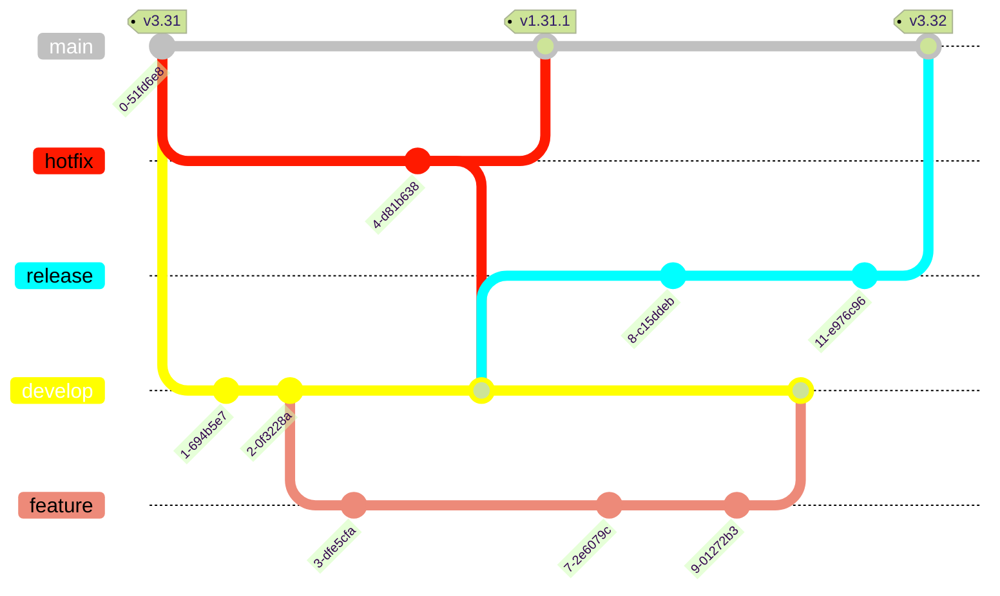
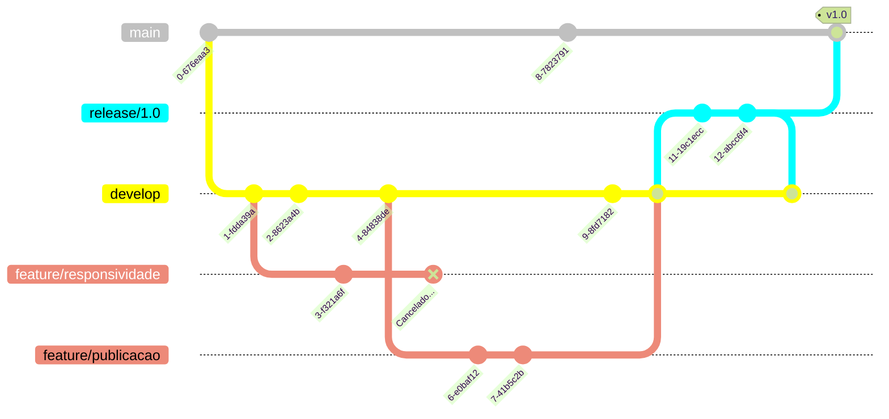
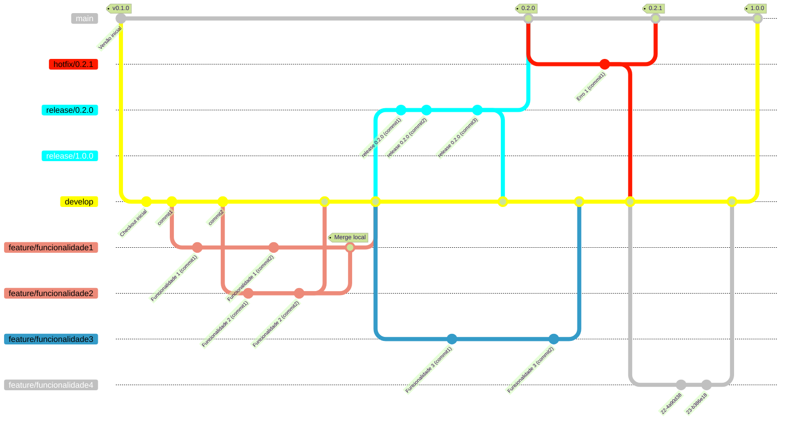
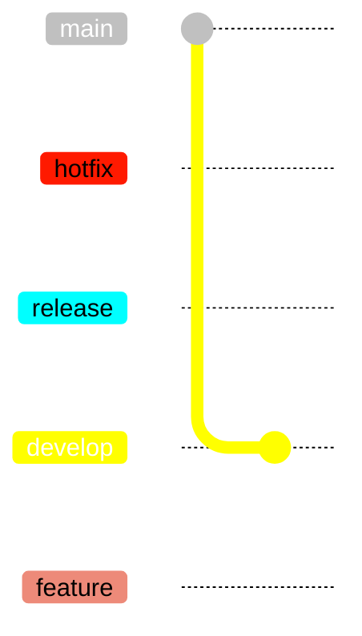
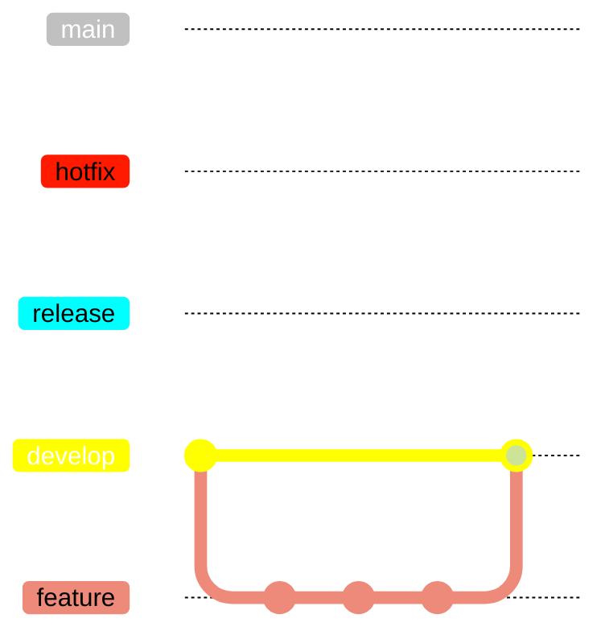
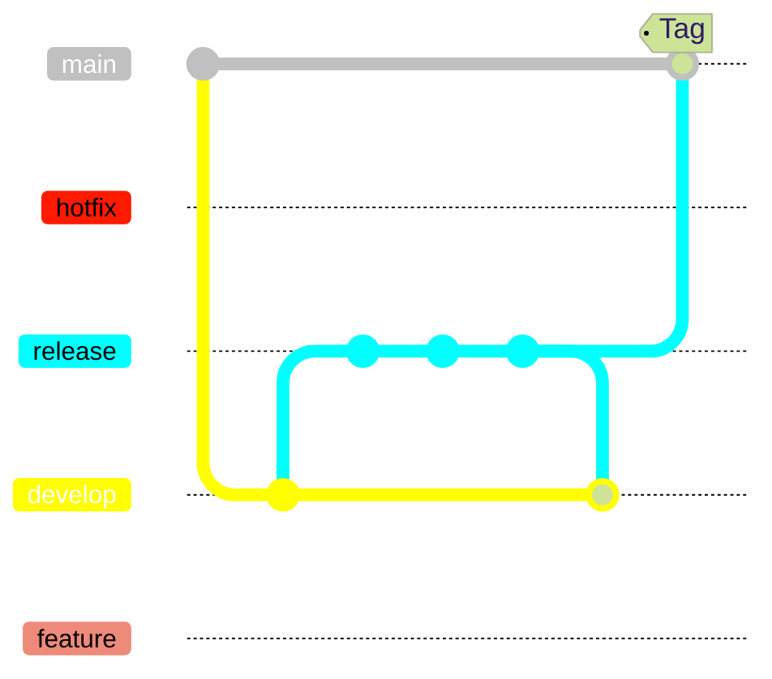
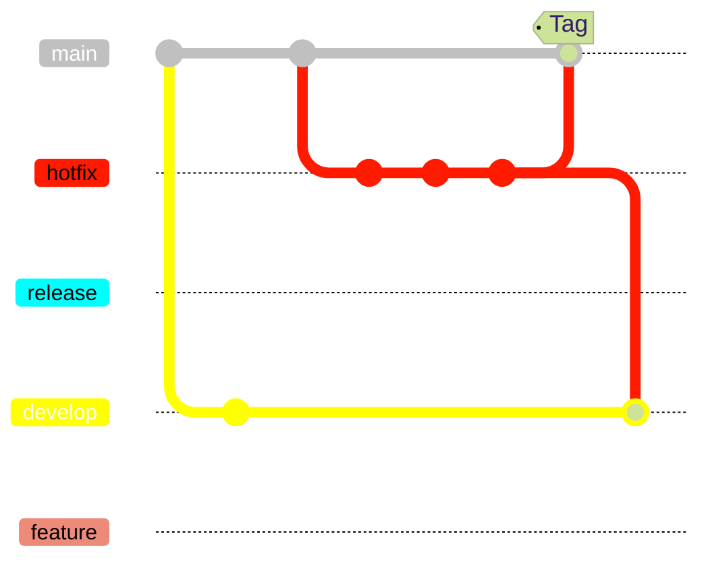

# Modelo de fluxo de trabalho dos repositórios Git

Esse documento descreve os nı́veis de ramificações, o versionamento de código e o processo de condução de artefatos que será adotado por todos os projetos da Fábrica de Software. O processo aqui proposto é baseado no fluxo do Git Flow.

## Ramificações (Branches)

O processo de ramificações prevê a existência de cinco nı́veis possı́veis, alguns obrigatórios e outros opcionais, segue resumo das branches:

### Branch main

Representa o principal ramo e contém o código mais estável do projeto, ou seja, o código que está em produção.

* **Justificativa:** necessidade de ter uma branch permanente que contém o código estável do projeto.
* **Tipo:** Principal
* **Tempo de vida:** infinito
* **Criado de:** N/A
* **Pode ir para:** develop



### Branch develop

Contém código que irá gerar a próxima versão de implantação. Nessa branch que ocorrem as integrações das linhas de desenvolvimento que estão ocorrendo em paralelo.

* **Justificativa:** permite reunir um conjunto de novas funcionalidades, integrá-las, testá-las e somente depois disso encaminhar essa nova versão para a branch main, com ações intermediárias.
* **Tipo:** Principal
* **Tempo de vida:** infinito
* **Criado de:** main (na primeira vez)
* **Pode ir para:** main



### Branch feature/*

É uma branch criada para abrigar o desenvolvimento de uma nova funcionalidade, com tempo de vida correspondente ao desenvolvimento da funcionalidade que a origina. Pode não ser levada ao repositório remoto (opcional). Pode ser cancelada antes de ser incorporada ao branch develop. Tem o objetivo de ser uma ramificação com tempo de vida curto, para evitar que a branch develop fique desatualizada.

* **Justificativa:** permite o isolamento da produção de uma nova caracterı́stica sem interferir na branch develop. Os testes unitários podem ser realizados no código que está nesta branch, só depois de passar por esses testes, o código será encaminhado para a branch develop, onde testes de integração serão realizados.
* **Tipo:** Suporte
* **Tempo de vida:** finito
* **Criado de:** develop
* **Pode ir para:** develop
* **Padrão de nomenclatura:** feature/nome_que_expressa_nova_funcionalidade

### Branch release/*

Permite ajustes e correções finas e prepara os metadados (número de versão, observações, informações complementares, etc) na versão que irá para a produção.

* **Justificativa:** Quando uma versão de código sai da branch develop para a branch release, libera a branch develop para receber código de branches features em evolução que irão compor versões futuras.
* **Tipo:** Suporte
* **Tempo de vida:** finito
* **Criado de:** develop
* **Pode ir para:** develop e main
* **Padrão de nomenclatura:** release/número_próxima_versão

### Branch hotfix/*

Correção de erros identificados no código que está em produção (ambiente de produção).

* **Justificativa:** Isola correções de erros que estão em produção, sem interferir na branch develop, até que os erros sejam resolvidos e também permite que as correções sejam realizadas de forma rápida, sem a necessidade de resolução de possı́veis conflitos.
* **Tipo:** Suporte
* **Tempo de vida:** finito
* **Criado de:** main
* **Pode ir para:** main e develop
* **Padrão de nomenclatura:** hotfix/sub-número_próxima_versão

## Descrição do Fluxo

Neste modelo proposto, duas branches são obrigatórias: main e develop. As branches feature, release e hotfix são opcionais e serão criadas em situações que dão suporte às ações nas branches main e develop. O diagrama abaixo esboça situações possı́veis do fluxo.



### Branch main e develop

Neste fluxo, ao invés de uma única branch principal, existem duas ramificações para registrar o histórico do projeto. A branch main armazena o histórico dos lançamentos de novas versões, e a ramificação de develop serve como uma ramificação de integração para novas funcionalidades ou caracterı́sticas, conforme ilustrado no diagrama abaixo. A marcação de novas versões é realizada na branch main com um número de versão, seguindo a convenção de versionamento semântico.



O primeiro passo do fluxo é criar uma branch com o nome main, caso o SCM ( Sistema de Controle de Código Fonte ) não tenha criado de forma automática. A estrutura inicial do projeto a ser desenvolvido será criada na branch main. Com o projeto criado na branch main, o segundo passo do fluxo é criar uma branch develop e executar um checkout tendo como origem a branch main.

### Branch feature

Cada novo recurso ou caracterı́stica a ser desenvolvida, deverá gerar sua própria ramificação (feature/nome_feature), que tem como origem a ramificação develop. Quando a implementação é concluı́da, ela é mesclada de volta na ramificação develop, isso é ilustrado no próximo diagrama. As ramificações feature não teriam necessidade de atualizarem o repositório central. Contudo, é conveniente enviar a produção local para o repositório remoto, como garantia de backup ou para permitir a colaboração com os demais desenvolvedores do projeto.

O nome da ramificação feature deve representar de forma geral o recurso/caracterı́stica que irá agregar ou alterar do projeto. O nome sempre terá o prefixo feature/, seguido do nome do recurso ou caracterı́stica, por exemplo: feature/crud-cidadao, feature/relatorio-ocorrencias-bairro.

O trabalho desempenhado em cada branch feature sempre será executado por apenas um
desenvolvedor. Essa medida complementa o requisito de atomicidade de funcionalidade e evita que a produção de um desenvolvedor interfira na produção dos demais.



Outro procedimento importante é que antes do conteúdo da branch feature retornar para
develop, deve ser realizada uma operação de merge na branch feature com o conteúdo da develop. Essa ação minimiza conflitos que ocorreriam na branch develop, se o conteúdo da feature fosse enviado diretamente, visto que, os conflitos serão resolvidos primeiro na feature de origem, para depois ser enviado para a develop.

Depois que uma branch feature for encaminhada para a develop (via merge), esta poderá ser excluı́da.

### Branch Release

As branches desse tipo serão criadas quando uma versão do código na branch develop atingir o nı́vel desejado para uma nova versão de implantação.

A criação de uma branch release se justifica por dois motivos:

1. a branch release é caracterizada por conter um nı́vel de confiança maior do que a branch develop, e que se encontram em nı́vel de preparação para ser juntada com a branch main, mas que ainda estão em sofrendo algum tipo de teste ou avaliação;

2. a branch release pode ser usada para a realização de configurações da nova versão (número de versão, informações de log, etc).

Os nomes dessas branches começam com release/ e termina com o número da próxima versão
do software, seguindo as regras do versionamento semântico, por exemplo: release/2.3.0. O diagrama abaixo ilustra esse fluxo.



Quando o código de uma branch release atinge o nı́vel de produção, este será enviado para a branch main. Caso tenha ocorrido alguma correção ou ajuste no código enquanto ele estava na branch release, este deve ser enviado também para a branch develop, para que as mudanças sejam incorporadas no código das próximas versões em desenvolvimento.

O código que chega na branch main a partir de uma branch release, deve receber uma tag, com o mesmo número contido no sufixo da release de origem.

Considerando os motivos que levam a criação de uma branch release, ela pode ser considerada opcional, quando não há a necessidade de liberar a branch develop para receber códigos de features que irão compor versões futuras ou quando o código da develop já esteja totalmente maduro para ser encaminhado para a produção. Nesses casos então o código da develop poderá ser enviado diretamente para a branch main. A tag será gerada a partir da última versão em produção, seguindo o padrão de versionamento semântico.

Depois que uma branch release for encaminhada para a main (via merge), esta poderá ser
excluı́da.

### Branch Hotfix

É usada para a realização de correções de bugs crı́ticos encontrados no ambiente de produção, o que justifica sua criação a partir da branch main. Após as correções, o código deve voltar para a branch main e atualizar também a branch develop, visto que as próximas versões que estão em desenvolvimento devem conter as correções realizadas na hotfix.

A branch hotfix não pode ser usada para a inclusão de uma nova funcionalidade ou caracterı́stica ao software, mas sim corrigir algo já existente e que impede ou não atende a versão que está em produção. Isso justifica o fato que de o tempo de vida de uma branch hotfix deve ser curto, como horas ou no máximo um dia.

Os nomes dessas branches começam com hotfix/ e terminam com o próximo sub-número de
versão, por exemplo, se a versão atual em produção é 2.3.0, a branch deve ser criada com o nome hotfix/2.3.1, seguindo as regras do padrão de versionamento semântico. O diagrama abaixo ilustra esse fluxo.



Quando o código retornar para a branch main, será gerada uma tag com o mesmo número do
sufixo da branch hotfix de origem.

Depois que uma branch hotfix for encaminhada para a main (via merge), esta poderá ser
excluı́da.

## Padrões de Commits

Esta seção contém boas práticas para realização de commits nos projetos. As recomendações aqui contidas são uma adaptação da especificação do Conventional Commits e manter este nı́vel de organização e coordenação no versionamento do código ajuda a:

* Melhorar a legibilidade do histórico de versionamento do Git;
* Aumentar a velocidade na hora de procurar por mudanças especı́ficas no código;
* Entender, facilmente, quais mudanças estão sendo publicadas dentro de um pipeline;
* Possibilitar a geração de um CHANGELOG ou de release notes de maneira totalmente automatizada;
* Incentivar os desenvolvedores a realizarem commits de maneira pensada e especı́fica, sem realizar commits grandes e cheios de mudanças;
* Possibilita a utilização de ferramentas de automação de commits.

Este documento define um conjunto de regras para criar um histórico de commit explı́cito, o que facilita a criação de ferramentas automatizadas. Esta convenção segue o Padrão de Nomenclatura de Versões, descrevendo os recursos, correções e modificações que quebram a compatibilidade nas mensagens de commit.

### Estrutura

A mensagem do commit deve ser estruturada da seguinte forma:

```markdow
[tipo][escopo opcional]: [descrição]

[corpo opcional]

[rodapé opcional]
```

O commit contém os seguintes elementos estruturais, para comunicar a intenção ao utilizador da sua biblioteca.

### Tipos

Os tipos são a descrição inicial de o que o commit está realizando, sendo obrigatórios e devendo seguir um padrão bem definido.

1. **feat:** um commit do tipo feat inclui um novo recurso na sua base de código (isso se correlaciona com MINOR do versionamento semântico).

2. **fix:** um commit do tipo fix soluciona um problema na sua base de código (isso se correlaciona com PATCH do versionamento semântico).

3. **docs:** um commit do tipo docs refere-se a inclusão ou alteração somente de arquivos de documentação.

4. **chore:** um commit do tipo chore contém atualização de tarefas que não ocasiona alteração no código de produção mas mudanças de ferramentas, mudanças de configuração e bibliotecas que realmente não entram em produção. Basicamente engloba pequenas alterações que não são novas funcionalidades.

5. **refactor:** um commit do tipo refactor abrange quaisquer mudanças que sejam executadas no código, porém não alterem a funcionalidade final da tarefa impactada.

6. **style:** um commit do tipo style inclui alterações referentes a formatações na apresentação do código que não afetam o significado do código, como por exemplo: espaço em branco, formatação, ponto e vírgula ausente etc.).

7. **test:**  um commit do tipo test adiciona testes ausentes ou corrigindo testes existentes nos processos de testes automatizados (TDD);

Um escopo pode ser adicionado ao tipo do commit, para fornecer informações contextuais adicionais e está contido entre parênteses, por exemplo feat(parser): adiciona capacidade de interpretar arrays.

### Detalhando commit

Nesta seção são detalhados os elementos que compõem o padrão de documentação dos commits.

#### **Escopo**

O escopo do commit é uma parte opcional, curta e de fácil compreensão. É nela que iremos dizer qual parte do código foi modificada, como indicar que fizemos alterações em uma determinada funcionalidade.

#### **Descrição**

A descrição, juntamente com o tipo, é uma das partes mais importantes do padrão: é aqui
que deve ser descrito, de maneira clara, sucinta e simplificada, o que foi realizado no commit. É recomendado que essa parte tenha, no máximo, 70 caracteres, para que não se estenda muito.

#### **Corpo**

O corpo do commit é também opcional. Nele, pode-se realizar uma descrição mais detalhada
do commit, indicar razões para a realização dele e consequências que ele pode vir a causar, além de alguma outra observação que seja pertinente.

#### **Rodapé**

O rodapé, assim como o corpo, é opcional e informativo. Ele pode ser usado como uma finalização do commit, informando o encerramento de uma issue ou o pertencimento/associação a uma task também.

### Exemplos

Mensagens de commit com descrição:

```Markdown
test: garante que DbLoadSurveys seja lançado se LoadSurveysRepository for lançado
```

```Markdown
docs: ortografia correta de CHANGELOG
```

Mensagens de commit com tipo, escopo e descrição:

```Markdown
feat(login/rotas): alteração nas configurações de rota para o login
```

```Markdown
feat(lang): adiciona tradução para português brasileiro
```

Mensagem de commit com tipo, descrição e corpo:

```Markdown
feat: garante que LoadSurveysController retorne 204 se não houver conteúdo

Retorna o código 204 se o método de carregamento de pesquisa não retornar o conteúdo
```

Mensagem de commit com tipo, escopo, descrição, corpo e rodapé:

```Markdown
fix(core): remover apis wtf* obsoletos e extintos

essas APIs foram obsoletas na v8, então elas devem permanecer até a v10, mas como estão extintas, estamos removendo-as mais cedo para que não ocupem o tamanho da carga útil

PR close #33949
```

#### Assinatura de commits

É recomendado fazer a assinatura dos commits para garantir a confiabilidade na publicação do código que você escreve. Adicionando a flag **-S** no comando, já é possível fazer a verificação do trabalho feito.

```code
git commit -S
```

#### Granularidade

A recomendação mais aceita para a granularidade é que cada commit seja atômico, considerando o escopo de uma única funcionalidade. Assim, cada commit só pode conter incremento ou correções de uma funcionalidade. Essa diretriz desconsidera o número de arquivos envolvidos, ou seja, não importa quantos arquivos foram afetados, desde que todos representem uma única funcionalidade ou correção.

## Padrão de Nomenclatura de Versões

Esse padrão de nomenclatura das versões é uma adaptação do sistema de versionamento semântico de autoria de Tom Preston-Werner, criador do Gravatars e co-fundador do GitHub.

Este processo de versionamento irá marcar commits especı́ficos como estáveis e atribuir um rótulo aos mesmos, integrando o padrão de nomenclatura de versionamento ao repositório de código fonte.

### Nı́veis

O padrão de nomenclatura de versões de software está dividido em três nı́veis: Maior, Menor e Correção.

Podemos de forma sucinta representar como **[maior].[menor].[correção]**:

* **[correção]**: otimização e/ou correção de bugs;

* **[menor]**: novas funcionalidades compatı́veis com versões anteriores;

* **[maior]**: novas funcionalidades incompatı́veis com versões anteriores. Pode envolver uma mudança arquitetural, de stack de tecnologias adotadas, uma reformulação da interface de usuário e/ou da experiência do usuário com o software, por exemplo.

Abaixo apresenta-se o detalhamento de regras quanto aos diferentes nı́veis:

1. Um número de versão normal DEVE ter o formato de **X.Y.Z**, onde X, Y, e Z são inteiros não negativos, e NÃO DEVE conter zeros à esquerda. X é a versão Maior, Y é a versão Menor, e Z é a versão de Correção. Cada elemento DEVE aumentar numericamente. Por exemplo: 1.9.0 - 1.10.0 - 1.11.0.

2. Uma vez que um pacote versionado foi lançado(released) em Produção, o conteúdo desta versão NÃO DEVE ser modificado. Qualquer modificação DEVE ser lançada como uma nova versão.

3. No inı́cio do desenvolvimento, a versão Maior DEVE ser zero (0.y.z). Qualquer coisa pode mudar a qualquer momento. O software não deve ser considerado estável.

4. Versão 1.0.0 define a primeira versão disponibilizada em Produção.

5. Versão Menor Y (x.Y.z — x maior que 0) DEVE ser incrementada quando houverem novas funcionalidades introduzidas e/ou alteradas no software. DEVE ser incrementada se
qualquer funcionalidade do software for descontinuada(retirada).

6. Versão de Correção Z (x.y.Z — x maior que 0) DEVE ser incrementado com a correção de bugs. Uma correção de bug é definida como uma mudança interna que corrige um comportamento incorreto. A versão de Correção deve ser redefinida para 0(zero) quando a versão Menor for incrementada.

7. Versão Maior X (X.y.z | X > 0) DEVE ser incrementada se forem introduzidas mudanças incompatíveis na API pública. PODE incluir alterações a nível de versão Menor e de versão de Correção. Versão de Correção e Versão Menor DEVEM ser redefinidas para 0(zero) quando a versão Maior for incrementada.

### Desenvolvimento Inicial

A versão de desenvolvimento inicial DEVE ser 0.1.0 e, então, incrementar a uma versão ‘menor’ em cada lançamento subsequente.

## Configuração do ambiente

Para interagir com o fluxo de versionamento de código é preciso configurar seu ambiente, esta seção contém as informações a respeito desses ajustes.

### Instalação do Git

Primeiramente é necessário fazer a instalação do Git no sistema operacional.

Instalando no Linux:

Se for utilizado uma distribuição baseada em Debian como o Ubuntu, use o apt-get:

```code
sudo apt-get install git-all
```

Se é utilizado a distribuição Fedora, pode ser usar o yum:

```code
sudo yum install git-all
```

Para mais informações acesse: <https://git-scm.com/book/pt-br/v2/Come%C3%A7ando-Instalando-o-Git>

### Instalação do Git Flow

Como o processo aqui proposto é baseado no fluxo do Git Flow então vai ser utilizado os comandos presente no mesmo e para isso é preciso instalá-lo:

Para distribuições baseada em Debian como o Ubuntu, use:

```code
sudo apt-get install git-flow
```

Para mais detalhes acesse: <https://skoch.github.io/Git-Workflow/>

### Autenticação

Na execução dos commits para o repositório remoto é fundamental estar autenticado. É possível fazer esse processo de duas maneiras: HTTPS e SSH. Ambos têm uma maneira diferente de efetuar a autenticação.

É possível efetuar esse processo acessando este tutorial: <https://blog.cod3r.com.br/autenticacao-no-github-pela-linha-de-comando/>

Recomenda-se utilizar o método [SSH](https://blog.cod3r.com.br/autenticacao-no-github-pela-linha-de-comando/#:~:text=acessar%20a%20conta.-,Autentica%C3%A7%C3%A3o%20com%20SSH,-SSH%20%C3%A9%20uma).

## Exemplo prático

O roteiro abaixo apresenta o modelo de versionamento e ramificação para fins de exemplificação prática, desde a criação do repositório até a realização dos commits.

### Configuração do projeto

1. Se o repositório não existir, crie configurando os seguintes dados:
    * Selecione o template **"ifmt-esa/Template"** em modelo de repositório (**Repository template**);
    * Deixe marcada a opção incluir todas as branches (**include all branches**).
    * Preencha o nome do repositório (**Repository name**);
    * Coloque uma pequena descrição sobre esse repositório (**Description**);
    * Por último clique em criar repositório(**Create repository**)

    

2. Copie as informações para clonar o repositório. É recomendado que use o modo **SSH**.

    

3. Entre no terminal do computador e execute o comando para clonar inserindo a URL copiada:

    ```code
    git clone URL
    ```

### Comandos iniciais do Git Flow

Dentro do projeto utilize o comando abaixo para iniciar o Git Flow:

  ```code
  git flow init
  ```

  Assim será solicitado, como visto abaixo, para quais branches você gostaria de usar. Você pode simplesmente apertar **enter** para todos.

  ```code
  Which branch should be used for bringing forth production releases?
    - develop
    - main
  Branch name for production releases: [main] 

  Which branch should be used for integration of the "next release"?
    - develop
  Branch name for "next release" development: [develop] 

  How to name your supporting branch prefixes?
  Feature branches? [feature/] 
  Bugfix branches? [bugfix/] 
  Release branches? [release/] 
  Hotfix branches? [hotfix/] 
  Support branches? [support/] 
  Version tag prefix? [] 
  Hooks and filters directory? [/home/exemplo-fluxo-git/.git/hooks] 
  ```

Pronto, com isso já é possível utilizar os comandos Git e Git Flow para manusear as branches.

Caso aconteça algo de errado e precise reiniciar as configurações iniciais do Git Flow então utilize o próximo comando:

  ```sh
  git flow init -f
  ```

### Exemplo prático na branch feature

Para criar um novo recurso ou caracterı́stica a ser desenvolvida (feature), deverá gerar sua própria ramificação utilizando o comando que vem a seguir:

  ```sh
  git flow feature start nome-da-feature
  ```

Será mostrado um resumo das ações:

  ```shell
  Switched to a new branch 'feature/nome-da-feature'

  Summary of actions:
  - A new branch 'feature/nome-da-feature' was created, based on 'develop'
  - You are now on branch 'feature/nome-da-feature'

  Now, start committing on your feature. When done, use:

      git flow feature finish nome-da-feature
  ```

Com essa branch criada é possível trabalhar nela sem afetar a ramificação original (develop).

Depois de fazer as alterações no projeto, execute o comando a seguir para adicionar os arquivos alterados na pilha do commit:

  ```sh
  git add nome_do_arquivo
  ```

Caso queira adicionar todos os arquivos modificados então utilize:

  ```sh
  git add .
  ```

O commit com uma mensagem simples é feito aplicando o comando abaixo (siga os padrões de commits recomendados presente na seção `Padrões de Commits` ).

Use o sinalizador **-S** para assinar os commits:

  ```sh
  git commit -S -m "tipo: descricao"
  ```

O próximo comando é usado para fazer commits mais detalhado:

  ```sh
  git commit -S
  ```

Vai ser aberto um local no terminal para criação da descrição. Crie a mensagem e saia do local pressionando **Crtl-x**, depois a letra **s** para salvar o buffer modificado e por último pressione **enter**.

```sh
[tipo][escopo opcional]: [descrição]

[corpo opcional]

[rodapé opcional]

# Please enter the commit message for your changes. Lines starting
# with '#' will be ignored, and an empty message aborts the commit.
#
# No ramo feature/nome-da-feature
# Mudanças a serem submetidas:
#       modified:   nome-dos-arquivos-modificados

^G Ajuda        ^O Gravar        ^W Onde está?    ^K Recortar      ^T Executar      
^C Local        M-U Desfazer     M-A Marcar       M-] Parênteses   M-Q Anterior     
^B Voltar       ^X Sair          ^R Ler o arq     ^\ Substituir    ^U Colar         
^J Justificar   ^/ Ir p/ linha   M-E Refazer      M-6 Copiar       ^Q Onde estava   
M-W Próxima     ^F Encaminhar
```

Caso queira disponibilizar essa feature remotamente com objetivo que os outros usuários acessem, execute o comando:

```sh
git flow feature publish nome-da-feature
```

Assim será mostrado um resumo das ações:

```shell
Summary of actions:
- The remote branch 'feature/nome-da-feature' was created or updated
- The local branch 'feature/nome-da-feature' was configured to track the remote branch
- You are now on branch 'feature/nome-da-feature'
```

Se um integrante da equipe alterar essa mesma branch, é possível fazer pull utilizando o comando abaixo:

```sh
git pull origin nome-da-branch
```

Se desejar baixar uma feature publicada por um outro usuário então use o comando a seguir:

```sh
git flow feature track nome-da-feature
```

Quando terminar o uso da branch então  utilize o comando abaixo para mesclar com a develop.

```sh
git flow feature finish nome-da-feature
```

Será mostrado algo pedindo para digitar uma mensagem de confirmação com o objetivo  de explicar por que essa mesclagem é necessária. Fica opcional a escrita da mensagem.

Pressione o **Crtl-x** para sair e confirmar.

```sh
Merge branch 'feature/nome-da-feature' into develop
# Please enter a commit message to explain why this merge is necessary,
# especially if it merges an updated upstream into a topic branch.
#
# Lines starting with '#' will be ignored, and an empty message aborts
# the commit.


^G Ajuda        ^O Gravar        ^W Onde está?    ^K Recortar      ^T Executar      
^C Local        M-U Desfazer     M-A Marcar       M-] Parênteses   M-Q Anterior     
^B Voltar       ^X Sair          ^R Ler o arq     ^\ Substituir    ^U Colar         
^J Justificar   ^/ Ir p/ linha    M-E Refazer      M-6 Copiar      ^Q Onde estava   
M-W Próxima     ^F Encaminhar
```

É mostrado um resumo das ações:

```sh
Summary of actions:
- The feature branch 'feature/nome-da-feature' was merged into 'develop'
- Feature branch 'feature/nome-da-feature' has been locally deleted; it has been remotely deleted from 'origin'
- You are now on branch 'develop'
```

Não esqueça de executar o comando para enviar as alterações para o repositório remoto.

```sh
git push origin nome-da-branch
```

Ou utilize o comando para enviar todas as branches:

```sh
git push --all
```

### Exemplo prático na branch release

A criação de uma release é feita aplicando o comando abaixo (siga os padrões descritos nas seções `Branch Release` e `Padrão de Nomenclatura de Versões`):

```sh
git flow release start versao-da-release
```

Siga os mesmos passos para execução dos commits e envio ao repositório remoto mostrado no tópico `Exemplo prático na branch feature`.

Caso queira disponibilizar essa release remotamente para que possa ser usada por outros usuários, execute o comando:

```sh
git flow release publish versao-da-release
```

Se um integrante da equipe alterar essa mesma branch, é possível fazer pull utilizando o comando abaixo:

```sh
git pull origin nome-da-branch
```

Se desejar baixar uma release publicada por um outro usuário então use o comando a seguir:

```sh
git flow release track versao-da-release
```

Depois que todos os ajustes forem feitos então use o próximo comando para finalizar a branch.

```sh
git flow release finish versao-da-release
```

Logo depois é pedido para adicionar uma mensagem de mesclagem e essa ação é opcional.

```sh
Merge branch 'release/versao-da-release'
# Please enter a commit message to explain why this merge is necessary,
# especially if it merges an updated upstream into a topic branch.
#
# Lines starting with '#' will be ignored, and an empty message aborts
# the commit.


^G Ajuda        ^O Gravar        ^W Onde está?    ^K Recortar      ^T Executar      
^C Local        M-U Desfazer     M-A Marcar       M-] Parênteses   M-Q Anterior     
^B Voltar       ^X Sair          ^R Ler o arq     ^\ Substituir    ^U Colar         
^J Justificar   ^/ Ir p/ linha   M-E Refazer      M-6 Copiar       ^Q Onde estava   
M-W Próxima     ^F Encaminhar
```

Pressione o **Crtl-x** para sair e confirmar.

É solicitado uma mensagem para criação da tag. Crie uma descrição que se relacione com a criação dessa nova versão.

```sh
Mensagem sobre essa tag
#
# Write a message for tag:
#   versao-da-release
# Lines starting with '#' will be ignored.

G Ajuda         ^O Gravar        ^W Onde está?    ^K Recortar      ^T Executar      
^C Local        M-U Desfazer     M-A Marcar       M-] Parênteses   M-Q Anterior     
^B Voltar       ^X Sair          ^R Ler o arq     ^\ Substituir    ^U Colar         
^J Justificar   ^/ Ir p/ linha   M-E Refazer      M-6 Copiar       ^Q Onde estava   
M-W Próxima     ^F Encaminhar
```

Confirme pressionando **Crtl-x**, depois a letra **s** para salvar o buffer modificado e por último pressione **enter**.

No console vai aparecer um resumo sobre os comentários adicionados.

```sh
Merge tag 'versao-da-release' into develop

Mensagem sobre essa tag
# Please enter a commit message to explain why this merge is necessary,
# especially if it merges an updated upstream into a topic branch.
#
# Lines starting with '#' will be ignored, and an empty message aborts
# the commit.


^G Ajuda         ^O Gravar        ^W Onde está?    ^K Recortar      ^T Executar      
^C Local         M-U Desfazer     M-A Marcar       M-] Parênteses   M-Q Anterior     
^B Voltar        ^X Sair          ^R Ler o arq     ^\ Substituir    ^U Colar         
^J Justificar    ^/ Ir p/ linha   M-E Refazer      M-6 Copiar       ^Q Onde estava   
M-W Próxima      ^F Encaminhar
```

Pressione o **Crtl-x** para sair e confirmar.

Em seguida vai ser mostrado um resumo das ações:

```sh
Summary of actions:
- Release branch 'release/versao-da-release' has been merged into 'main'
- The release was tagged 'versao-da-release'
- Release tag 'versao-da-release' has been back-merged into 'develop'
- Release branch 'release/versao-da-release' has been locally deleted
- You are now on branch 'develop'
```

Por último, execute um push para mandar as modificações ao repositório remoto utilizando o comando de envio de todas as branches.

```code
git push --all
```

Também é preciso enviar as tags criadas para o repositório usando o próximo comando.

```code
git push origin --tags
```

### Exemplo prático na branch hotfix

A mesma lógica é feita no manejo da branch hotfix.

A criação da hotfix:

```code
git flow hotfix start versao-da-hotfix
```

Caso queira disponibilizar esse hotfix remotamente:

```code
git flow release publish versao-da-hotfix
```

Se um integrante da equipe alterar essa mesma branch, é possível fazer pull utilizando o comando abaixo:

```code
git pull origin nome-da-branch
```

Se desejar baixar uma hotfix publicada:

```code
git flow hotfix track versao-da-hotfix
```

Depois que a correção for feita, use o próximo comando para finalizar a branch.

```code
git flow hotfix finish versao-da-hotfix
```

Logo após é pedido para adicionar uma mensagem de mesclagem e essa ação é opcional.

```sh
Merge branch 'hotfix/versao-da-hotfix'
# Please enter a commit message to explain why this merge is necessary,
# especially if it merges an updated upstream into a topic branch.
#
# Lines starting with '#' will be ignored, and an empty message aborts
# the commit.


^G Ajuda        ^O Gravar        ^W Onde está?    ^K Recortar      ^T Executar      
^C Local        M-U Desfazer     M-A Marcar       M-] Parênteses   M-Q Anterior     
^B Voltar       ^X Sair          ^R Ler o arq     ^\ Substituir    ^U Colar         
^J Justificar   ^/ Ir p/ linha   M-E Refazer      M-6 Copiar       ^Q Onde estava   
M-W Próxima     ^F Encaminhar
```

Pressione o Crtl-x para sair e confirmar.

É solicitado uma mensagem para criação da tag. Crie uma descrição que se relacione com a criação dessa nova versão.

```sh
Mensagem sobre essa tag
#
# Write a message for tag:
#   versao-da-hotfix
# Lines starting with '#' will be ignored.

G Ajuda         ^O Gravar        ^W Onde está?    ^K Recortar      ^T Executar      
^C Local        M-U Desfazer     M-A Marcar       M-] Parênteses   M-Q Anterior     
^B Voltar       ^X Sair          ^R Ler o arq     ^\ Substituir    ^U Colar         
^J Justificar   ^/ Ir p/ linha   M-E Refazer      M-6 Copiar       ^Q Onde estava   
M-W Próxima     ^F Encaminhar
```

Confirme pressionando **Crtl-x**, depois a letra **s** para salvar o buffer modificado e por último pressione **enter**.

No console vai aparecer um resumo sobre os comentários adicionados.

```sh
Merge tag 'versao-da-hotfix' into develop

Mensagem sobre essa tag
# Please enter a commit message to explain why this merge is necessary,
# especially if it merges an updated upstream into a topic branch.
#
# Lines starting with '#' will be ignored, and an empty message aborts
# the commit.


^G Ajuda         ^O Gravar        ^W Onde está?    ^K Recortar      ^T Executar      
^C Local         M-U Desfazer     M-A Marcar       M-] Parênteses   M-Q Anterior     
^B Voltar        ^X Sair          ^R Ler o arq     ^\ Substituir    ^U Colar         
^J Justificar    ^/ Ir p/ linha   M-E Refazer      M-6 Copiar       ^Q Onde estava   
M-W Próxima      ^F Encaminhar
```

Pressione o **Crtl-x** para sair e confirmar.

Em seguida vai ser mostrado um resumo das ações:

  ```code
  Summary of actions:
  - Hotfix branch 'hotfix/versao-da-hotfix' has been merged into 'main'
  - The hotfix was tagged 'versao-da-hotfix'
  - Hotfix tag 'versao-da-hotfix' has been back-merged into 'develop'
  - Hotfix branch 'hotfix/versao-da-hotfix' has been locally deleted
  - You are now on branch 'develop'
  ```

Por último, execute um push para mandar as modificações ao repositório remoto utilizando o comando de envio de todas as branches.

```code
git push --all
```

Também é preciso enviar a tag criada para o repositório remoto usando o próximo comando.

```code
git push origin --tags
```
