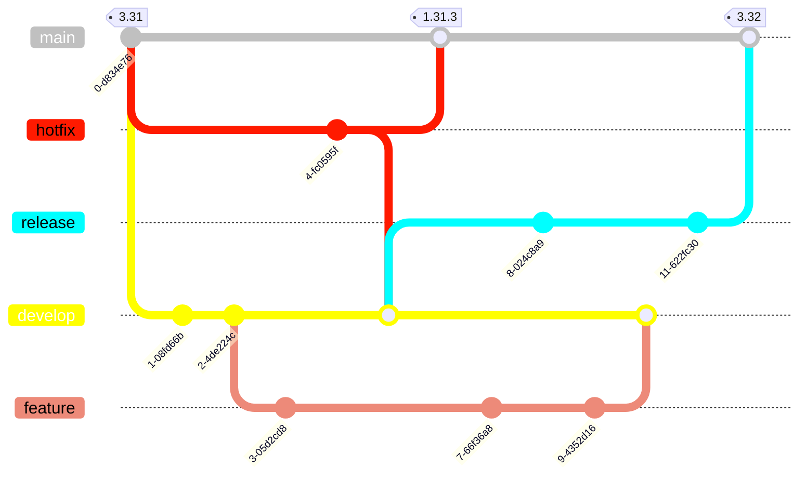
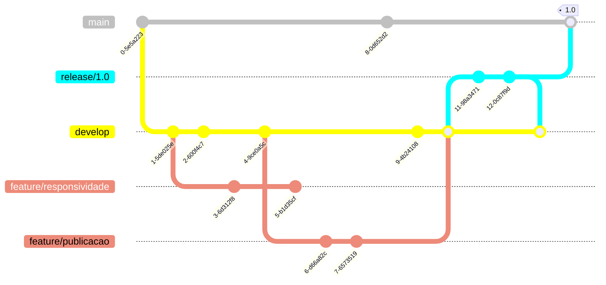

# Modelo de fluxo de trabalho dos repositórios Git

Esse documento descreve os nı́veis de ramificações, o versionamento de código e o processo de condução de artefatos que será adotado por todos os projetos da Fábrica de Software. O processo aqui proposto é baseado no fluxo do Git Flow.

## Ramificações (Branches)

O processo de ramificações prevê a existência de cinco nı́veis possı́veis, alguns obrigatórios e outros opcionais, segue resumo das branches:

### Branch main

Representa o principal ramo e contém o código mais estável do projeto, ou seja, o código que está em produção.

* **Justificativa:** necessidade de ter uma branch permanente que contém o código estável do projeto.
* **Tipo:** Principal
* **Tempo de vida:** infinito
* **Criado de:** N/A
* **Pode ir para:** develop

### Branch develop

Contém código que irá gerar a próxima versão de implantação. Nessa branch que ocorrem as integrações das linhas de desenvolvimento que estão ocorrendo em paralelo.

* **Justificativa:** permite reunir um conjunto de novas funcionalidades, integrá-las, testá-las e somente depois disso encaminhar essa nova versão para a branch main, com ações intermediárias.
* **Tipo:** Principal
* **Tempo de vida:** infinito
* **Criado de:** main (na primeira vez)
* **Pode ir para:** main

### Branch feature/*

É uma branch criada para abrigar o desenvolvimento de uma nova funcionalidade, com tempo de vida correspondente ao desenvolvimento da funcionalidade que a origina. Pode não ser levada ao repositório remoto (opcional). Pode ser cancelada antes de ser incorporada ao branch develop. Tem o objetivo de ser uma ramificação com tempo de vida curto, para evitar que a branch develop fique desatualizada.

* **Justificativa:** permite o isolamento da produção de uma nova caracterı́stica sem interferir na branch develop. Os testes unitários podem ser realizados no código que está nesta branch, só depois de passar por esses testes, o código será encaminhado para a branch develop, onde testes de integração serão realizados.
* **Tipo:** Suporte
* **Tempo de vida:** finito
* **Criado de:** develop
* **Pode ir para:** develop
* **Padrão de nomenclatura:** feature/nome_que_expressa_nova_funcionalidade

### Branch release/*

Permite ajustes e correções finas e prepara os metadados (número de versão, observações, informações complementares, etc) na versão que irá para a produção.

* **Justificativa:** Quando uma versão de código sai da branch develop para a branch release, libera a branch develop para receber código de branches features em evolução que irão compor versões futuras.
* **Tipo:** Suporte
* **Tempo de vida:** finito
* **Criado de:** develop
* **Pode ir para:** develop e main
* **Padrão de nomenclatura:** release/número_próxima_versão

### Branch hotfix/*

Correção de erros identificados no código que está em produção (ambiente de produção).

* **Justificativa:** Isola correções de erros que estão em produção, sem interferir na branch develop, até que os erros sejam resolvidos e também permite que as correções sejam realizadas de forma rápida, sem a necessidade de resolução de possı́veis conflitos.
* **Tipo:** Suporte
* **Tempo de vida:** finito
* **Criado de:** main
* **Pode ir para:** main e develop
* **Padrão de nomenclatura:** hotfix/sub-número_próxima_versão
